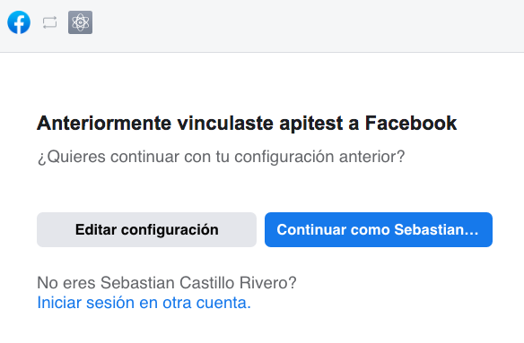
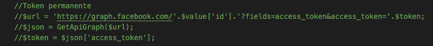

# Instagram-php
Por ahora la clase contiene solo metodos get y set para la carga y obtención de datos de las publicaciones y comentarios. Cada publicacion genera un json que incluye estadísticas de las mismas. La idea es ir incorporando nuevas llamadas a la graph api para ampliar las posibilidades de obtención de datos de las cuentas de instagram.
## Instrucciones de uso
- Primero se debe ingresar al index.php, para cargar los datos del usuario. Esto se hace mediante un facebook login, que recupera el token temporal y lo envía a setUsuario.php.
- setUsuario.php generará un json con un token de larga duración (60 dias), los datos del usuario, las páginas de facebook y cuentas de instagram asociadas a esas páginas, almacenandolas en un archivo json con el email del usuario como nombre del archivo (email.json).
- Si se desea usar un token permanente, en vez de uno de larga duración, hay que descomentar las lineas correspondientes al seteo del token permanente.

## Creando una instancia de la clase Instagram
- El metodo constructor de la clase Instagram requiere del email del usuario y la uri de la base de datos mongodb. Ejemplo: $instagram = new InstagramApi('email@email.com','uri-de-bd-en-mongodb');

## Atributos
- $email;
- $user_data;
- $mongodb;

## Metodos
- SetEmail($email_input)
- SetUserData()
- SetMongoDb($uri)
- GetDatos($uri)
- SetPublicacionesYComentarios()
- GetPublicaciones()
- GetComentarios()

## Aclaraciones
- SetPublicacionesYComentarios() carga los datos en mongodb
- GetPublicaciones() obtiene los datos de la base mongodb
- GetComentarios() obtiene los datos de la base mongodb
